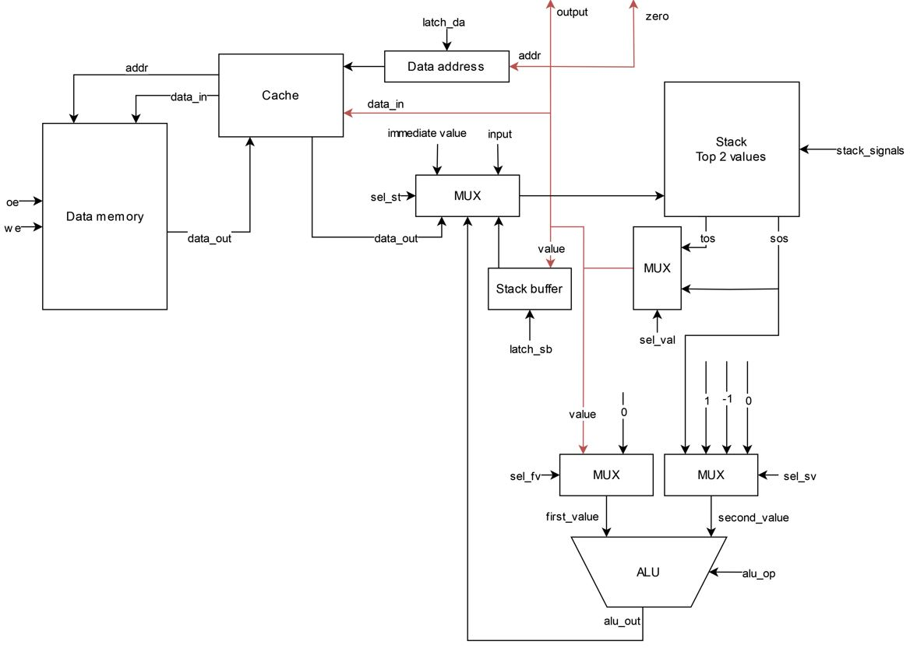
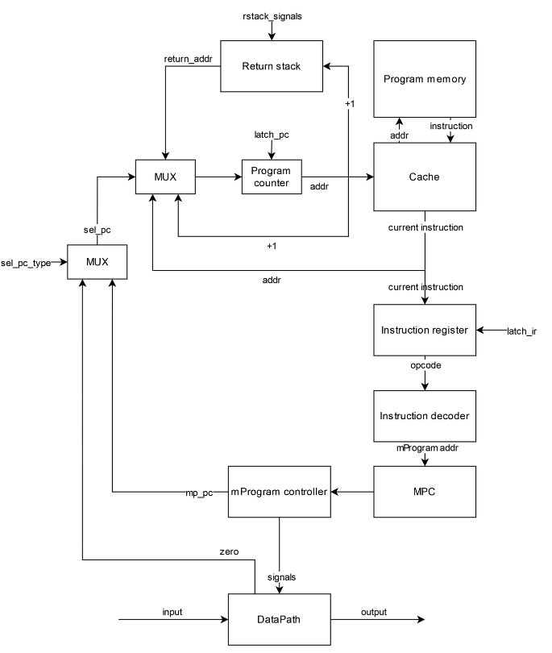
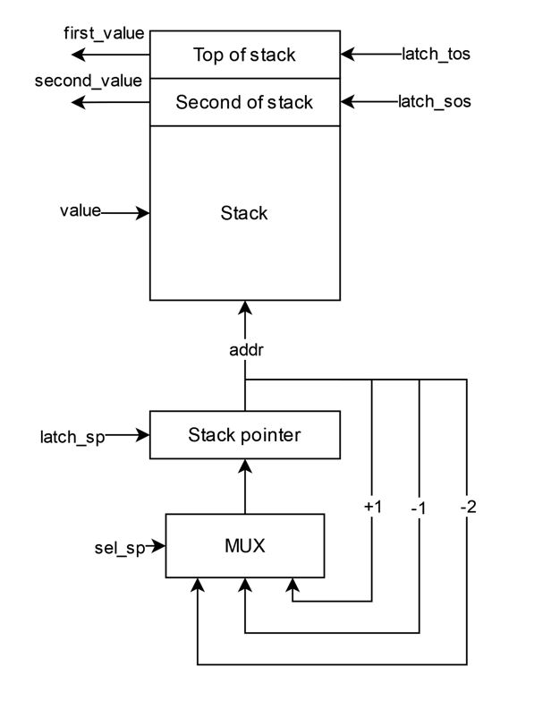
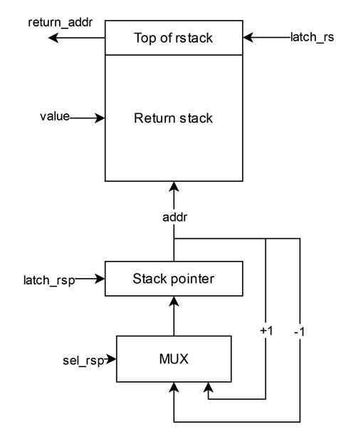
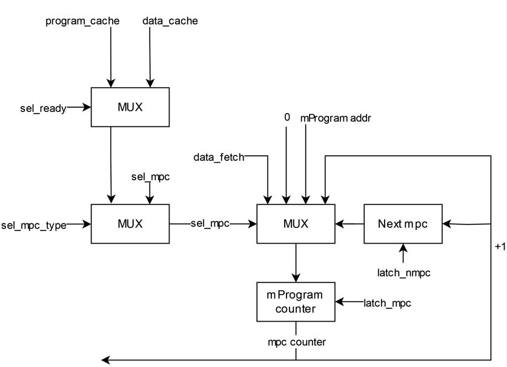
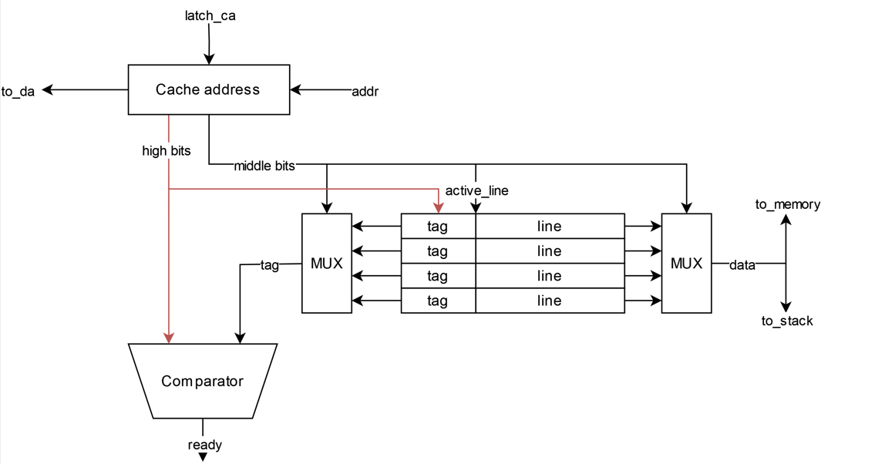

# Архитектура компьютера. Лабораторная работа 3

- Манухин Константин Александрович, P3221
- `asm | stack | harv | mc -> hw | instr | binary -> struct | stream | port | cstr | prob1 | cache`
- Усложнённый вариант

## Язык программирования
``` ebnf
program ::= [data_part] [code_part]

data_part ::= ".data:" [comment] "\n" {data_line} 

data_line ::= name data [comment] "\n"

data ::= "NUMBER" number 
       | "STRING" string
       | "BUFFER" number

code_part ::= ".code:" [comment] "\n" {code_line}

code_line ::= label [comment]
            | instr [comment]
            | [comment] "\n"
            
label ::= name ":" "\n"

instr ::= op0
        | op1
        
op0 ::= "HLT"
      | "RET"
      | "NOP"
      | "POP"
      | "LOAD"
      | "DROP"
      | "SWAP"
      | "DUP"
      | "INC"
      | "DEC"
      | "ADD"
      | "SUB"
      | "DIV"
      | "MOD"
      | "INPUT"
      | "OUTPUT"
      
op1 ::= "JMP" name
      | "JZ" name
      | "CALL" name
      | "PUSH" name 
      | "PUSH" number
        
comment ::= ";" {<any except "\n">}

number ::= ["-"] { <any of "0-9"> }

name ::= <any of "a-z A-Z _"> { <any of "a-z A-Z 0-9 _"> }

string ::= {<any except "\n" ";">}
```

_Операции потока программы_
- `HLT` - стоп программы
- `JMP` - перейти к метке (адресу памяти команд)
- `JZ` - перейти к метке (адресу памяти команд), если на вершине стека 0, **НЕ удаляет вершину стека**
- `CALL` - вызвать функцию по адресу памяти команд и записать адрес в стек возврата
- `RET` - вернуться по адресу из стека возврата
- `NOP` - пустышка 

_Операции работы со стеком_
- `PUSH` - закинуть значение на вершину стека (например, если указать имя переменной, то это сохранит её адрес)
- `POP` - поместить первое значение в стеке по адресу второго
- `LOAD` - закинуть значение на вершину стека из памяти по адресу первого значения в стеке
- `DROP` - удалить верхнее значение из стека
- `SWAP` - поменять местами второе и первое на стеке
- `DUP` - копировать значение на стеке

_Арифметические операции_
- `INC` - увеличить на один значение на вершине стека
- `DEC` - уменьшить на один значение на вершине стека
- `ADD` - сложить второе с первым, результат на вершину стека
- `SUB` - вычесть из второго первое на стеке, результат на вершину стека
- `MUL` - умножить второе на первое, результат на вершину стека
- `DIV` - поделить нацело второе на первое, результат на вершину стека
- `MOD` - остаток от деления второго на первое, результат на вершину стека

_Операции работы с I\O_
- `INPUT` - ввести значение извне в стек
- `OUTPUT` - вывести строку из стека и удалить

_Типы данных_
- `STRING` - нул-терминированная строка
- `BUFFER` - буфер заполненный нулями
- `NUMBER` - целое число

Особенности: 
- Код выполняется последовательно
- При трансляции все метки в коде заменяются на соответствующие адреса
- По умолчанию при чтении значения в стеке, оно удаляется
- Память выделяется и заполняется начальными значениями статически при запуске модели
- Видимость данных - глобальная
- Литералы:
  - Целое число
  - Строка

## Организация памяти
Модель памяти процессора:
- Гарвардская архитектура - память данных и память команд
- Память команд:
  - Машинное слово - 32 бита
  - Линейное адресное пространство
  - Реализуется списком целых чисел
  - Одно число - одна инструкция или аргумент
- Память данных:
  - Машинное слово - 32 бита, знаковое
  - Линейное адресное пространство
  - Реализуется списком целых чисел
  - Одно число - одно значение
- Память микрокоманд: 
  - Машинное слово - количество видов сигналов
  - Линейное адресное пространство
  - Реализуется списком списков активных сигналов
- Адресация абсолютная (`JMP` `JZ` `CALL`)
- Прямая загрузка (`PUSH`)
- Для реализации подпрограмм присутствует стек возврата, в котором хранятся адреса следующих инструкций после возврата из подпрограммы
- Управление процессором осуществляется с помощью микрокода

Модель памяти:
- При запуске программы память выделяется статически и разделена на память данных, команд и микрокоманд
- Система команд построена вокруг стека, поэтому все инструкции (кроме управляющих потоком программы) так или иначе взаимодействуют с ним
- Все регистры вспомогательные и прямого доступа у программиста к ним нет
- Стеки имеют собственную память для обеспечения их быстрой работы (ибо стековый процессор)
- Можно осуществлять чтение и запись в память данных, в то время как к памяти команд можно обращаться с помощью меток при управлении потоком программы
- Инструкции и подпрограммы хранятся в памяти команд
- Статические данные хранятся в памяти данных. К динамическим данным можно отнести загруженные с помощью `PUSH`, которые хранятся на стеке
- Два кэша служат буфером при обращении к памяти команд и памяти данных. При обращении к памяти для загрузки значений в кэш происходит задержка, симулирующая время доступа к памяти.
```text
            Stack
+------------------------------+
| 00  : value                  |
|    ...                       |
| 10  : value                  | 
| 11  : left value             | <- stack pointer
|    ...                       |
+------------------------------+

       Instruction memory
+------------------------------+
| 00  : program start          |
| 01  : instruction            |
|    ...                       |
| 05  : CALL sub
|    ...                       |
| 10  : subprogram instruction |
| 11  : RET                    |
|    ...                       |
|  n  : HLT
+------------------------------+

          Data memory
+------------------------------+
| 00  : value                  |
| 01  : value                  |
|    ...                       |
| l+0 : string value           |
| l+1 : \0                     |
|    ...                       |
| c+0 : buffer \0              |
| c+1 : buffer \0              |
|    ...                       |
+------------------------------+

       Microprogram memory
+------------------------------+
| 00  : Signals                |
| 01  : Signals                |
|    ...                       |                
+------------------------------+
```
- Литералы загружаются на стек с помощью `PUSH`
- Литералы изначально находятся в статической памяти, если объявлены в разделе `.data`
  - Порядок такой же как при объявлении
- Строки хранятся по символу в машинном слове, конец строки обозначается с помощью `\0`
- Констант нет
- Инструкции не изменяются после компиляции программы и загрузки их в память
- Переход к следующей инструкции осуществляется
  - Последовательно
  - Безусловно - `CALL` `JMP`, `RET`
  - Условно -`JZ`
- Процедуры 
  - Хранятся в памяти данных вместе с другими инструкциями
  - Начало определяется меткой, к которой можно перейти с помощью `CALL`, при этом в стек возврата записывается адрес возврата
  - Конец - `RET`

## Система команд 
Особенности процессора
- Машинное слово - 32 бита, знаковое. Только абсолютная адресация
- Все данные представлены целым числом, поэтому с ними можно работать как с числом
- Регистры не доступны для программиста, но присутствуют специальные регистры
  - `program_counter` - хранит указатель на следующую инструкцию
  - `instruction_register` - хранит текущую инструкцию
  - `microprogram_counter` - хранит указатель на текущую микропрограмму
  - `next_mpc` - хранит возвратное значение для восстановления `microprogram_counter`
  - `stack_pointer` - указатель на вершину стека
  - `return_stack_pointer` - указатель на вершину стека возврата
  - `data_address` - указатель на ячейку памяти данных
  - `stack_buffer` - регистр для промежуточного хранения значений из стека
- Доступ к памяти данных осуществляется по адресу, хранящемуся в специальном регистре `data_address`
  - Установка адреса осуществляется путём автоматического инкрементирования или с помощью команд управления потоком программы
- Обработка данных:
  - Арифметические операции над значениями в стеке
  - Операции над стеком
  - Операциями ввода/вывода
- Ввод/вывод происходит с вершиной стека, через порт ввода/вывода соответственно
  - Порты реализованы с помощью списка чисел
- Поток управления:
  - Автоинкремент `Program counter`
  - Безусловный переход - `JMP` `CALL` `RET`
  - Условный переход - `JZ`, если на вершине стека ноль
  - `HLT` - остановка программы

### Набор инструкций
Все инструкции языка напрямую отображаются в инструкции процессора, за исключением инструкций выделения памяти для данных

Обозначения:
- PM - program memory
- DM - data memory
- DA - data address 
- MPC - microprogram counter
- PC - program counter
- Z - zero flag (на вершине стека ноль)
- RS - return stack
- RSP - return stack pointer
- SP - stack pointer
- TOS - top of stack
- SOS - second of stack
- IN - input port
- OUT - output port


Инструкции управления потоком программы

| Инструкция    | Кол-во тактов | Описание                                          |
|---------------|:-------------:|---------------------------------------------------|
| `HLT`         |       1       | Остановка программы                               |
| `JUMP` [addr] |       2       | MPC = 0, PC = PM[PC]                              |
| `JZ` [addr]   |       2       | MPC = 0, IF Z: PC = PM[PC]                        |
| `CALL` [addr] |       2       | MPC = 0, RPS = RPS + 1, RS[RSP] = PC, PC = PM[PC] |
| `RET`         |       1       | MPC = 0, PC = RS[RSP], RPS = RPS - 1,             |
| `NOP`         |       1       | Пустышка                                          |

Инструкции работы со стеком

| Инструкция     | Кол-во тактов | Описание                                     |
|----------------|:-------------:|----------------------------------------------|
| `PUSH` [value] |       2       | MPC = 0, SP = SP + 1, TOS = PM[PC]           |
| `POP`          |       3       | MPC = 0, DA = SOS, DM[DA] = TOS, SP = SP - 2 |
| `LOAD`         |       3       | MPC = 0, DA = TOS, TOS = DM[DA]              |
| `DROP`         |       1       | MPC = 0, SP = SP - 1                         |
| `SWAP`         |       2       | MPC = 0, SB = TOS, TOS = SOS + 0, SOS = SB   |
| `DUP`          |       2       | MPC = 0, SB = TOS, SP = SP + 1, TOS = SB     |

Инструкции арифметики

| Инструкция | Кол-во тактов | Описание                              |
|------------|:-------------:|---------------------------------------|
| `INC`      |       1       | MPC = 0, TOS = TOS + 1                |
| `DEC`      |       1       | MPC = 0, TOS = TOS - 1                |
| `ADD`      |       1       | MPC = 0, SOS = SOS + TOS, SP = SP - 1 |
| `SUB`      |       1       | MPC = 0, SOS = SOS - TOS, SP = SP - 1 |
| `MUL`      |       1       | MPC = 0, SOS = SOS * TOS, SP = SP - 1 |
| `DIV`      |       1       | MPC = 0, SOS = SOS / TOS, SP = SP - 1 |
| `MOD`      |       1       | MPC = 0, SOS = SOS % TOS, SP = SP - 1 |

Инструкции работы с I/O

| Инструкция    | Кол-во тактов | Описание                        |
|---------------|:-------------:|---------------------------------|
| `INPUT`       |       2       | MPC = 0, SP = SP + 1, TOS = IN  |
| `OUTPUT`      |       1       | MPC = 0, OUT = TOS, SP = SP - 1 |

Вспомогательные инструкции

| Инструкция          | Кол-во тактов | Описание                               |
|---------------------|:-------------:|----------------------------------------|
| `INSTRUCTION_FETCH` |       3       | PC = PC + 1, IR = PM[PC], MPC = ID[IR] |
| `DATA_CACHE_READ`   |      1+       | Проверка готовности кэша               |
| `DATA_CACHE_WRITE`  |      1+       | Проверка готовности кэша               |
| `PROG_CACHE_READ`   |      1+       | Проверка готовности кэша               |

### Кодирование инструкций
- Машинный код в бинарном формате
- Одна инструкция или аргумент - 32 бита
- Все инструкции данных заменяются на соответсвующее данные
- Вместо меток подставляется адрес в памяти команд

Пример:
```
1 - 00000010          - Opcode.INPUT
2 - 00000083 00000006 - Opcode.JZ break
4 - 00000011          - Opcode.OUTPUT
5 - 00000082 00000000 - Opcode.JMP loop
7 - 00000080          - Opcode.HLT
```

В модуле [isa.py](./machine/isa.py) тип данных `Opcode` - перечисление кодов операций с их бинарным представлением

### Память микрокоманд
- `Latch` - защелкнуть регистр
  - `DA` - data address
  - `TOS` - top of stack
  - `SOS` -second of stack
  - `SP` - stack pointer
  - `SB` - stack buffer
  - `RS` - return stack
  - `RSP` - return stack pointer
  - `PC` - program counter
  - `IR` - instruction register
  - `MPC` - microprogram counter
  - `NMPC` - next mpc
- `MUX` - управляющий сигнал на MUX
  - `STACK_VALUE` - входящее значение на стек
  - `ALU_LEFT` - значение на левый вход АЛУ
  - `ALU_RIGHT` - значение на правый вход АЛУ
  - `TYPE_PC` - тип выбора PC
  - `PC` - выбор значения PC
  - `MPC` - выбор значения MPC
  - `SP` - выбор значения SP 
  - `RSP` - выбор значения RSP
  - `DATA` - выходное значение со стека
  - `MPC_TYPE` - тип выбора MPC
  - `READY` - какой кэш проверять на готовность
- `ALU` - выбор операции АЛУ
- `DataMemory` - сигнал к памяти данных
  - `OE` - чтение 
  - `WE` - запись
- `IO` - сигнал к портам ввода/вывода
- `Cache_Fetch` - сигнал к кэшу
  - `DATA_READ` - чтение из памяти данных
  - `DATA_WRITE` - запись в память данных
  - `PROG_READ` - чтение из памяти команд

## Транслятор
Интерфейс командной строки:
```
usage: translator.py [-h] source_file target_file
                                                 
Трансляция кода                                  
                                                 
positional arguments:                            
  source_file  Имя файла с кодом                 
  target_file  Имя выходного файла

options:
  -h, --help   show this help message and exit 
```

Реализовано в модуле [translator.py](./translator.py)

Принципы работы:
- Пустые строки или только с комментариями пропускаются
- Комментарии в строках отсекаются
- Два прохода: разделение на токены и отображение в машинный код
- Также сохраняются мнемоники для инструкций в отдельный файл
- Проверяется, что числа в допустимом диапазоне
- Проверяется корректное число токенов в строке
- Проверяется, что метки и имена переменных не были переопределены
- Отдельная обработка сначала `.data`, потом `.code`
- `.data`:
  - Разделение на 3 токена по первым 2 пробелам
  - Замена на данные по типу данных
     - `NUMBER` - по значению
     - `STRING` - каждый символ = одно машинное слово, заканчивается `\0`
     - `BUFFER` - заменяется на n `\0`
  - Сохранение адреса переменной для последующей замены обращений по имени
  - Первым словом записывается длина части данных
- `.code`
  - Если оканчивается на `:` - метка, сохраняется адрес для последующей замены обращений по имени
  - Инструкция без аргумента прямо отображается в машинный код
  - Инструкция с аргументом отображается в машинный код и аргумент записывается по значению

## Модель процессора
Интерфейс командной строки:
```
usage: simulation.py [-h] [--stack_size STACK_SIZE] [--debug_limit DEBUG_LIMIT] [--limit LIMIT] [--cache_size CACHE_SIZE] [--bus_size BUS_SIZE] [--delay_ticks DELAY_TICKS]
                     [--stack_log] [--cache_log] [--inst_fetch_log]
                     code_file [input_file]

Симуляция процессора

positional arguments:
  code_file             Имя файла бинарным с кодом
  input_file            Имя входного файла (опционально)

options:
  -h, --help            show this help message and exit
  --stack_size STACK_SIZE
                        Размер стека (по умолчанию 10)
  --debug_limit DEBUG_LIMIT
                        Лимит отладки (по умолчанию 200)
  --limit LIMIT         Лимит тиков (по умолчанию 100000)
  --cache_size CACHE_SIZE
                        Размер кэша (по умолчанию 8)
  --bus_size BUS_SIZE   Размер шины (по умолчанию 8)
  --delay_ticks DELAY_TICKS
                        Задержка при обращении в память (по умолчанию 10)
  --stack_log           Логирование стека
  --cache_log           Логирование кэша
  --inst_fetch_log      Логирование запроса инструкции
```

Реализован в модуле: [simulation.py](./simulation.py)
- Микропрограммное управление
- Кэши 
- Стековая архитектура


### DataPath


Реализован в классе `DataPath` в модуле [datapath.py](./machine/datapath.py)
- Все сигналы описаны в модуле [microprogram.py](./machine/microprogram.py), реализованы в виде методов класса
- Управляющие сигналы приходят из памяти микрокоманд
- `Data memory` - однопортовая память: либо читаем, либо пишем
- `Cache` - на доступ в `Data memory`
- `ALU` - АЛУ для выполнения арифметических операций
- `Stack` - стек
- `Stack buffer` - для промежуточных операций
- `Address register` - указатель на данные
- `input`/`output` - порты ввода/вывода

Сигналы:
- `latch_*` - защёлкнуть соответствующий регистр
  - `da` - `Data address`
  - `sb` - `Stack buffer`
- `sel_*` - выбрать значение на соответсвующее мультиплексоре
- `we` - активна запись в память
- `oe` - активно чтение из памяти
- `alu_op` - выбор арифметической операции
- `stack_signals` - сигналы управления стеком

Флаги:
- `zero` - для проверки вершины стека на ноль
### ControlUnit


Реализован в классе `ControlUnit` в модуле [control_unit.py](./machine/control_unit.py)   
- Все сигналы описаны в модуле [microprogram.py](./machine/microprogram.py), реализованы в виде методов класса
- Управляющие сигналы приходят из памяти микрокоманд
- Цикл процессора реализован в методе `decode_and_execute`
  1. Получение сигналов из памяти микрокоманд
  2. Подготовка сигналов
  3. Сигналы мультиплексоров
  4. Сигналы защелкивания регистров
  5. Сигналы защелкивания счетчиков
- `Data memory` - только читаем
- `Cache` - на доступ в `Program memory`
- `Return stack` - стек возврата
- `Program counter` - указатель на следующую инструкцию
- `Instruction register` - хранит текущую инструкцию
- `Instruction decoder` - декодирует опкод операции
- `MPC` - счетчик микрокоманд
  - `mProgram controller` - память микрокоманд
- `input`/`output` - порты ввода/вывода

Сигналы:
- `latch_*` - защёлкнуть соответствующий регистр
  - `pc` - `Program counter`
  - `ir` - `Instruction register`
- `sel_*` - выбрать значение на соответсвующее мультиплексоре
- `rstack_signals` - сигналы управления стеком возврата

Особенности работы модели:
- Подготовка и запуск модели происходит в методе `simulation` в модуле [simulation.py](./simulation.py)
- Шаг моделирования равен одному тику процессора
- Для журнала состояний процессора используется стандартный модуль `logging`
  - Текущая инструкция
  - Состояние регистров
  - Вершина стека
  - Текущая микрокоманда
  - Состояние стека и стека возврата
  - Состояние кешей
- Количество инструкций для моделирования и логирования лимитировано
- Остановка моделирования осуществляется при:
  - Превышении лимита количества выполняемых инструкций;
  - Исключении `EOFError` -- если нет данных для чтения из порта ввода;
  - Исключении `StopIteration` -- если выполнена инструкция `HALT`.

### Stacks



- Представляют собой список целых чисел
- Управляющие сигналы приходят из памяти микрокоманд
- Считываются значения из верхних элементов стека
- `Stack pointer` - указывает на верхний элемент в стеке
- `latch_sp` - защелкнуть `Stack pointer`
- `sel_sp` - выбрать значение на `Stack pointer`

### MPC


Память микрокоманд реализована в модуле [microprogram.py](./machine/microprogram.py) 
- Представляет собой список активных управляющих сигналов каждый тик процессора
- Память микрокоманд начинается с последовательности сигналов выборки инструкции (находится по нулевому адресу в память микрокоманд)
- Метод `opcode_to_MPType` отображает опкоды команд в соответсвующий адрес начала в памяти микрокоманд
- Сигналы `MUX.TYPE_PC_MPC`, `MUX.MPC_TYPE_NEXT` установлены по умолчанию и не присутствуют в списке в связи с их постоянным использованием, тк они подразумеваются по умолчанию и не несут много информации
- Микрокоманды разделены на группы:
  - `Latch` - защелкивание регистров
  - `MUX` - выбор значения на мультиплексоре
  - `ALU` - выпор операции АЛУ
  - `DataMemory` - чтение/запись в память
  - `IO` - операции с портами ввода/вывода
  - `Cache_Fetch` - операции работы с кэшем
  - `Halt` - остановка процессора
- Реализованы следующие последовательности сигналов:
  - Все команды из системы команд
  - `INSTRUCTION_FETCH` - выборка инструкции
  - `DATA_CACHE_READ` - чтение из кэша данных
  - `DATA_CACHE_WRITE` - запись в кэш данных
  - `PROG_CACHE_READ` - чтение из кэша команд

### Cache


Реализован в классе `Cache` в модуле [cache.py](./machine/cache.py)
- Кэш данных и кэш команд абсолютно одинаковые, но в качестве `cache address` выступает `data address` или `program counter`
- Прозрачен для программиста (нет прямого доступа)
- Строка кэша:
  - Кэш линия 
  - Тег
  - Флаг модифицированности
- Прямое отображение 
  - Старшие биты - тег 
  - Младшие биты - индекс строки кэша
- Чтение данных из кэша - 1 такт, из памяти - с задержкой
  - Задержка реализована с помощью состояния готовности, которое наступает, когда `ticks_left` = 0 и тег линии совпадает со старшими битами `cache address`
- Сравнение адресов происходит путем сравнения тега строки кэша по индексу младших бит 
- При чтении или записи данных, если строка занята и модифицирована, то происходит выгрузка строки в память
- При чтении записывается сразу несколько идущих подряд машинных слов (определяется величиной шины)
- В конце работы программы кэш выгружается в память

## Тестирование
Тестирование выполняется при помощи golden test-ов

- Реализованные программы лежат в [programs](./programs)
- Предлагаемые входные данные лежат в [inputs](./inputs)
- Конфигурации golden test-ов лежат в [golden](./golden) в виде файлов формата _.yml_
  - Код программы
  - Входные данные
  - Мнемоники машинного кода
  - Машинный код 
  - Выходные данные
  - Журнал работы процессора

Алгоритмы:
- Обязательные, минимум логов, демонстрирующие правильность работы процессора на разных алгоритмах и поведение процессора
  - [cat](./golden/cat_alg.yml) - вывод потенциально бесконечных входных данных
  - [hello](./golden/hello_alg.yml) - вывод сообщения
  - [hello_user](./golden/hello_user_alg.yml) - вывод приветсвия пользователя с учетов ввода
  - [prob1](./golden/prob1_alg.yml) - алгоритм на работу с числами
  - [bubble_sort](./golden/prob1_alg.yml) - пузырьковая сортировка
- Демонстрирующие работу кэша с различными настройками (включен лог кэша и задержка обращения в память = 10 тикам)
  - [bubble_sort_demonst](./golden/prob1_alg.yml) - 8 ячеек кэша, 8 машинных слов на шине
  - [bubble_sort_small_cache](./golden/prob1_alg.yml) - 2 ячейки кэша, 2 машинных слова на шине
  - [bubble_sort_small_bus](./golden/prob1_alg.yml) - 8 ячеек кэша, 1 машинное слово на шине
  

Запустить тесты: `poetry run pytest . -v`
Обновить конфигурацию golden tests: `poetry run pytest . -v --update-goldens`

Разбор теста `hello` ([hello](./golden/hello_alg.yml))
- Код программы
```text
.data:                      ; обозначаем начало раздела данных
    str STRING Hello world! ; объявляем переменную `str` типа данных `STRING` со значением `Hello world!`

.code:                      ; обозначаем начало раздела кода
    PUSH str                ; кладём адрес переменной `str` на стек

loop:                       ; метка `loop`
    DUP                     ; дублируем значение на стеке для загрузки значения
    LOAD                    ; загружаем значение по адресу с вершины стека
    JZ break                ; если на вершине `\0` (конец строки), то переходим к метке `break`
    OUTPUT                  ; выводим значение с вершины стека на порт вывода
    INC                     ; инкрементируем значение на вершине стека (в данном случае - указатель на элемент сроки)
    JMP loop                ; переходим к метке `loop`

break:                      ; метка `break`
    DROP                    ; удаляем значение с вершины стека (хороший тон - если стек пустой к концу программы)
    HLT                     ; остановка роботы программы
```
- Вывод транслятора
```
.\translator.py .\programs\hello.txt .\out\hello.out
LoC: 22 Code bytes: 52
```
- Машинный код (до перевода в машинный код)
```
[13,                                                        - длина части данных
72, 101, 108, 108, 111, 32, 119, 111, 114, 108, 100, 33, 0, - данные (строка `Hello world! и `\0`)
64, 0, 69, 66, 131, 10, 17, 32, 130, 2, 67, 128]            - код
```
- Мнемоники
```
14 - 00000040 00000000 - Opcode.PUSH str
16 - 00000045          - Opcode.DUP
17 - 00000042          - Opcode.LOAD
18 - 00000083 0000000A - Opcode.JZ break
20 - 00000011          - Opcode.OUTPUT
21 - 00000020          - Opcode.INC
22 - 00000082 00000002 - Opcode.JMP loop
24 - 00000043          - Opcode.DROP
25 - 00000080          - Opcode.HLT
```
- Вывод процессора (логирование уровня INFO)
```
.\simulation.py .\out\hello.out
INFO:root:Start simulation
WARNING:root:Debug limit exceeded!
INFO:root:output_buffer: Hello world!
INFO:root:End simulation
Hello world!
Instructions: 78 Ticks: 553
```
- Журнал работы, логирование уровня DEBUG (часть)
```
INFO     root:simulation.py:103 Start simulation
  DEBUG    root:simulation.py:40 [ 0: None         ] TICK:    0 PC:   0 MPC:  0 IR:   0 RSC: -1 TOS:  -1 AR:   0 SB:   0 SP: -1	INSTRUCTION_FETCH
  DEBUG    root:simulation.py:50 [ 0: None         ] TICK:    1 PC:   0 MPC:  5 IR:   0 RSC: -1 TOS:  -1 AR:   0 SB:   0 SP: -1	PROG_CACHE_READ_FETCH
  DEBUG    root:simulation.py:50 [ 0: None         ] TICK:    2 PC:   0 MPC:  5 IR:   0 RSC: -1 TOS:  -1 AR:   0 SB:   0 SP: -1	PROG_CACHE_READ_FETCH
  DEBUG    root:simulation.py:50 [ 1: Opcode.PUSH  ] TICK:    4 PC:   1 MPC:  2 IR:  64 RSC: -1 TOS:  -1 AR:   0 SB:   0 SP: -1	INSTRUCTION_FETCH
  DEBUG    root:simulation.py:50 [ 1: Opcode.PUSH  ] TICK:    5 PC:   1 MPC: 15 IR:  64 RSC: -1 TOS:  -1 AR:   0 SB:   0 SP: -1	PUSH
  DEBUG    root:simulation.py:50 [ 1: Opcode.PUSH  ] TICK:    6 PC:   1 MPC:  5 IR:  64 RSC: -1 TOS:  -1 AR:   0 SB:   0 SP:  0	PROG_CACHE_READ_FETCH
  DEBUG    root:simulation.py:50 [ 1: Opcode.PUSH  ] TICK:    7 PC:   1 MPC: 16 IR:  64 RSC: -1 TOS:  -1 AR:   0 SB:   0 SP:  0	PUSH
  DEBUG    root:simulation.py:50 [ 2: 0            ] TICK:    9 PC:   2 MPC:  5 IR:  64 RSC: -1 TOS:   0 AR:   0 SB:   0 SP:  0	PROG_CACHE_READ_FETCH
  DEBUG    root:simulation.py:50 [ 3: Opcode.DUP   ] TICK:   11 PC:   3 MPC:  2 IR:  69 RSC: -1 TOS:   0 AR:   0 SB:   0 SP:  0	INSTRUCTION_FETCH
  DEBUG    root:simulation.py:50 [ 3: Opcode.DUP   ] TICK:   12 PC:   3 MPC: 26 IR:  69 RSC: -1 TOS:   0 AR:   0 SB:   0 SP:  0	DUP
  DEBUG    root:simulation.py:50 [ 3: Opcode.DUP   ] TICK:   13 PC:   3 MPC: 27 IR:  69 RSC: -1 TOS:  -1 AR:   0 SB:   0 SP:  1	DUP
  DEBUG    root:simulation.py:50 [ 3: Opcode.DUP   ] TICK:   15 PC:   3 MPC:  5 IR:  69 RSC: -1 TOS:   0 AR:   0 SB:   0 SP:  1	PROG_CACHE_READ_FETCH
  DEBUG    root:simulation.py:50 [ 4: Opcode.LOAD  ] TICK:   17 PC:   4 MPC:  2 IR:  66 RSC: -1 TOS:   0 AR:   0 SB:   0 SP:  1	INSTRUCTION_FETCH
  DEBUG    root:simulation.py:50 [ 4: Opcode.LOAD  ] TICK:   18 PC:   4 MPC: 20 IR:  66 RSC: -1 TOS:   0 AR:   0 SB:   0 SP:  1	LOAD
  DEBUG    root:simulation.py:50 [ 4: Opcode.LOAD  ] TICK:   19 PC:   4 MPC: 21 IR:  66 RSC: -1 TOS:   0 AR:   0 SB:   0 SP:  1	LOAD
  DEBUG    root:simulation.py:50 [ 4: Opcode.LOAD  ] TICK:   20 PC:   4 MPC:  3 IR:  66 RSC: -1 TOS:   0 AR:   0 SB:   0 SP:  1	DATA_CACHE_READ_FETCH
  DEBUG    root:simulation.py:50 [ 4: Opcode.LOAD  ] TICK:   21 PC:   4 MPC:  3 IR:  66 RSC: -1 TOS:   0 AR:   0 SB:   0 SP:  1	DATA_CACHE_READ_FETCH
  DEBUG    root:simulation.py:50 [ 4: Opcode.LOAD  ] TICK:   22 PC:   4 MPC: 22 IR:  66 RSC: -1 TOS:   0 AR:   0 SB:   0 SP:  1	LOAD
  DEBUG    root:simulation.py:50 [ 4: Opcode.LOAD  ] TICK:   24 PC:   4 MPC:  5 IR:  66 RSC: -1 TOS:  72 AR:   0 SB:   0 SP:  1	PROG_CACHE_READ_FETCH
  DEBUG    root:simulation.py:50 [ 5: Opcode.JZ    ] TICK:   26 PC:   5 MPC:  2 IR: 131 RSC: -1 TOS:  72 AR:   0 SB:   0 SP:  1	INSTRUCTION_FETCH
  DEBUG    root:simulation.py:50 [ 5: Opcode.JZ    ] TICK:   27 PC:   5 MPC: 10 IR: 131 RSC: -1 TOS:  72 AR:   0 SB:   0 SP:  1	JZ
  DEBUG    root:simulation.py:50 [ 5: Opcode.JZ    ] TICK:   28 PC:   5 MPC:  5 IR: 131 RSC: -1 TOS:  72 AR:   0 SB:   0 SP:  1	PROG_CACHE_READ_FETCH
  DEBUG    root:simulation.py:50 [ 5: Opcode.JZ    ] TICK:   29 PC:   5 MPC: 11 IR: 131 RSC: -1 TOS:  72 AR:   0 SB:   0 SP:  1	JZ
  DEBUG    root:simulation.py:50 [ 6: Opcode.BUFFER] TICK:   31 PC:   6 MPC:  5 IR: 131 RSC: -1 TOS:  72 AR:   0 SB:   0 SP:  1	PROG_CACHE_READ_FETCH
  DEBUG    root:simulation.py:50 [ 7: Opcode.OUTPUT] TICK:   33 PC:   7 MPC:  2 IR:  17 RSC: -1 TOS:  72 AR:   0 SB:   0 SP:  1	INSTRUCTION_FETCH
  DEBUG    root:simulation.py:50 [ 7: Opcode.OUTPUT] TICK:   34 PC:   7 MPC: 37 IR:  17 RSC: -1 TOS:  72 AR:   0 SB:   0 SP:  1	OUTPUT
  DEBUG    root:datapath.py:186 output: H << 72
  DEBUG    root:simulation.py:50 [ 7: Opcode.OUTPUT] TICK:   36 PC:   7 MPC:  5 IR:  17 RSC: -1 TOS:   0 AR:   0 SB:   0 SP:  0	PROG_CACHE_READ_FETCH
  DEBUG    root:simulation.py:50 [ 8: Opcode.INC   ] TICK:   38 PC:   8 MPC:  2 IR:  32 RSC: -1 TOS:   0 AR:   0 SB:   0 SP:  0	INSTRUCTION_FETCH
  DEBUG    root:simulation.py:50 [ 8: Opcode.INC   ] TICK:   39 PC:   8 MPC: 28 IR:  32 RSC: -1 TOS:   0 AR:   0 SB:   0 SP:  0	INC
  DEBUG    root:simulation.py:50 [ 8: Opcode.INC   ] TICK:   41 PC:   8 MPC:  5 IR:  32 RSC: -1 TOS:   1 AR:   0 SB:   0 SP:  0	PROG_CACHE_READ_FETCH
  DEBUG    root:simulation.py:50 [ 8: Opcode.INC   ] TICK:   42 PC:   8 MPC:  5 IR:  32 RSC: -1 TOS:   1 AR:   0 SB:   0 SP:  0	PROG_CACHE_READ_FETCH
  DEBUG    root:simulation.py:50 [ 9: Opcode.JMP   ] TICK:   44 PC:   9 MPC:  2 IR: 130 RSC: -1 TOS:   1 AR:   0 SB:   0 SP:  0	INSTRUCTION_FETCH
  DEBUG    root:simulation.py:50 [ 9: Opcode.JMP   ] TICK:   45 PC:   9 MPC:  8 IR: 130 RSC: -1 TOS:   1 AR:   0 SB:   0 SP:  0	JMP
  DEBUG    root:simulation.py:50 [ 9: Opcode.JMP   ] TICK:   46 PC:   9 MPC:  5 IR: 130 RSC: -1 TOS:   1 AR:   0 SB:   0 SP:  0	PROG_CACHE_READ_FETCH
  DEBUG    root:simulation.py:50 [ 9: Opcode.JMP   ] TICK:   47 PC:   9 MPC:  9 IR: 130 RSC: -1 TOS:   1 AR:   0 SB:   0 SP:  0	JMP
  DEBUG    root:simulation.py:50 [ 2: 0            ] TICK:   49 PC:   2 MPC:  5 IR: 130 RSC: -1 TOS:   1 AR:   0 SB:   0 SP:  0	PROG_CACHE_READ_FETCH
  DEBUG    root:simulation.py:50 [ 2: 0            ] TICK:   50 PC:   2 MPC:  5 IR: 130 RSC: -1 TOS:   1 AR:   0 SB:   0 SP:  0	PROG_CACHE_READ_FETCH
  DEBUG    root:simulation.py:50 [ 3: Opcode.DUP   ] TICK:   52 PC:   3 MPC:  2 IR:  69 RSC: -1 TOS:   1 AR:   0 SB:   0 SP:  0	INSTRUCTION_FETCH
  DEBUG    root:simulation.py:50 [ 3: Opcode.DUP   ] TICK:   53 PC:   3 MPC: 26 IR:  69 RSC: -1 TOS:   1 AR:   0 SB:   0 SP:  0	DUP
  DEBUG    root:simulation.py:50 [ 3: Opcode.DUP   ] TICK:   54 PC:   3 MPC: 27 IR:  69 RSC: -1 TOS:  72 AR:   0 SB:   1 SP:  1	DUP
  DEBUG    root:simulation.py:50 [ 3: Opcode.DUP   ] TICK:   56 PC:   3 MPC:  5 IR:  69 RSC: -1 TOS:   1 AR:   0 SB:   1 SP:  1	PROG_CACHE_READ_FETCH
  DEBUG    root:simulation.py:50 [ 4: Opcode.LOAD  ] TICK:   58 PC:   4 MPC:  2 IR:  66 RSC: -1 TOS:   1 AR:   0 SB:   1 SP:  1	INSTRUCTION_FETCH
  DEBUG    root:simulation.py:50 [ 4: Opcode.LOAD  ] TICK:   59 PC:   4 MPC: 20 IR:  66 RSC: -1 TOS:   1 AR:   0 SB:   1 SP:  1	LOAD
  DEBUG    root:simulation.py:50 [ 4: Opcode.LOAD  ] TICK:   60 PC:   4 MPC: 21 IR:  66 RSC: -1 TOS:   1 AR:   1 SB:   1 SP:  1	LOAD
  DEBUG    root:simulation.py:50 [ 4: Opcode.LOAD  ] TICK:   61 PC:   4 MPC:  3 IR:  66 RSC: -1 TOS:   1 AR:   1 SB:   1 SP:  1	DATA_CACHE_READ_FETCH
  DEBUG    root:simulation.py:50 [ 4: Opcode.LOAD  ] TICK:   62 PC:   4 MPC: 22 IR:  66 RSC: -1 TOS:   1 AR:   1 SB:   1 SP:  1	LOAD
  DEBUG    root:simulation.py:50 [ 4: Opcode.LOAD  ] TICK:   64 PC:   4 MPC:  5 IR:  66 RSC: -1 TOS:  101 AR:   1 SB:   1 SP:  1	PROG_CACHE_READ_FETCH
  DEBUG    root:simulation.py:50 [ 5: Opcode.JZ    ] TICK:   66 PC:   5 MPC:  2 IR: 131 RSC: -1 TOS:  101 AR:   1 SB:   1 SP:  1	INSTRUCTION_FETCH
  DEBUG    root:simulation.py:50 [ 5: Opcode.JZ    ] TICK:   67 PC:   5 MPC: 10 IR: 131 RSC: -1 TOS:  101 AR:   1 SB:   1 SP:  1	JZ
  DEBUG    root:simulation.py:50 [ 5: Opcode.JZ    ] TICK:   68 PC:   5 MPC:  5 IR: 131 RSC: -1 TOS:  101 AR:   1 SB:   1 SP:  1	PROG_CACHE_READ_FETCH
  DEBUG    root:simulation.py:50 [ 5: Opcode.JZ    ] TICK:   69 PC:   5 MPC: 11 IR: 131 RSC: -1 TOS:  101 AR:   1 SB:   1 SP:  1	JZ
  DEBUG    root:simulation.py:50 [ 6: Opcode.BUFFER] TICK:   71 PC:   6 MPC:  5 IR: 131 RSC: -1 TOS:  101 AR:   1 SB:   1 SP:  1	PROG_CACHE_READ_FETCH
  DEBUG    root:simulation.py:50 [ 7: Opcode.OUTPUT] TICK:   73 PC:   7 MPC:  2 IR:  17 RSC: -1 TOS:  101 AR:   1 SB:   1 SP:  1	INSTRUCTION_FETCH
  DEBUG    root:simulation.py:50 [ 7: Opcode.OUTPUT] TICK:   74 PC:   7 MPC: 37 IR:  17 RSC: -1 TOS:  101 AR:   1 SB:   1 SP:  1	OUTPUT
  DEBUG    root:datapath.py:186 output: He << 101
```

### CI
CI при помощи Github Action

[python.yml](./.github/workflows/python.yml)
- `poetry` - управления зависимостями для языка программирования Python.
- `coverage` - формирование отчёта об уровне покрытия исходного кода.
- `pytest` - утилита для запуска тестов.
- `ruff` - утилита для форматирования и проверки стиля кодирования.

Запускается при пуше в репозиторий на ветку мастер
Тестовые процессы
- `test` - запуск тестов
- `lint` - запуск линтера

### Для сбора аналитики

| ФИО                               | <алг>           | <LoC> | <code байт> | <code инстр.> | <инстр.> | <такт.> | <вариант>                                                                         |
|:----------------------------------|:----------------|:------|:------------|:--------------|:---------|:--------|:----------------------------------------------------------------------------------|
| Манухин Константин Александрович  | cat             | 11    | 32          | 5             | 107      | 677     | `asm - stack - harv - mc - instr - binary - stream - port - cstr - prob1 - cache` |
| Манухин Константин Александрович  | hello           | 18    | 104         | 9             | 78       | 553     | `asm - stack - harv - mc - instr - binary - stream - port - cstr - prob1 - cache` |
| Манухин Константин Александрович  | hello_user_name | 43    | 436         | 27            | 133      | 1032    | `asm - stack - harv - mc - instr - binary - stream - port - cstr - prob1 - cache` |

